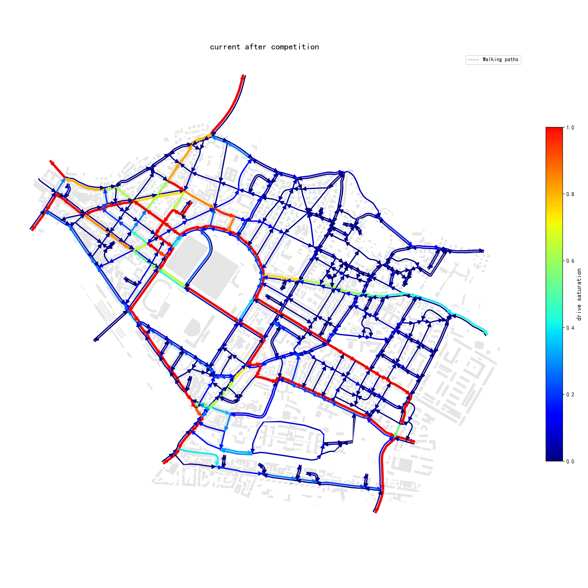
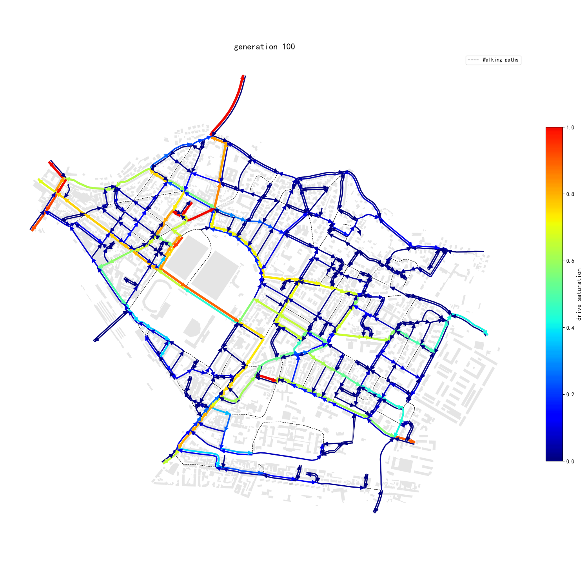

# Florence 城市路网优化系统

[](https://www.python.org/)
[](https://networkx.org/)
[](https://osmnx.readthedocs.io/)

本项目是一个**通用城市路网交通流量分析与优化系统**，采用佛罗伦萨数据作为示例。系统包含**数据准备、优化算法、可视化**三个核心模块，可应用于任何城市的交通路网优化。

---

## 🌍 通用性说明

本系统设计为**通用城市路网优化工具**，可应用于任何城市的交通分析。佛罗伦萨数据仅作为示例提供。要应用于其他城市，您需要准备以下数据：

1. **真实流量数据**（可选）：用于校准模型参数
2. **路网数据**：街道几何、车道数、方向限制等
3. **建筑数据**：建筑位置、功能类型（居住、商业、办公等）
4. **交通分配模式**：出行方式划分参数（步行、自行车、汽车）
5. **建筑功能产生量/吸引量**：不同建筑类型的交通生成率

系统核心算法（流量模拟、优化、可视化）完全独立于具体城市数据，只需替换数据文件即可迁移到新城市。

## 📁 项目包含的5个核心文件

| 文件 | 功能 | 作用 |
|------|------|------|
| **`road_dowload.py`** | 数据下载 | 从OpenStreetMap下载路网和建筑数据 |
| **`pre_calculate.py`** | 数据处理 | 构建路网图 + 计算OD矩阵 |
| **`subgraph_optimize_temperature.py`** | 优化算法 | 模拟退火（SA）优化道路方向配置 |
| **`subgraph_optimize_genetic.py`** | 优化算法 | 遗传算法（GA/NSGA2）优化道路方向配置 |
| **`draw_result.py`** | 可视化 | 绘制流量条带图、饱和度图等 |

---

## 📊 优化效果展示

以下是佛罗伦萨路网优化前后的流量饱和度对比图：

<div align="center">
  <table>
    <tr>
      <td align="center"><b>优化前 (当前状态)</b></td>
      <td align="center"><b>优化后 (优化方案)</b></td>
    </tr>
    <tr>
      <td></td>
      <td></td>
    </tr>
    <tr>
      <td align="center">当前路网流量分布<br>饱和度不均，存在拥堵区域</td>
      <td align="center">优化后路网流量分布<br>饱和度更均衡，拥堵缓解</td>
    </tr>
  </table>
</div>

**图例说明**：
- 🟢 **绿色**：饱和度低 (0.0-0.3) - 道路资源闲置
- 🟡 **黄色**：饱和度适中 (0.3-0.7) - 理想运行状态  
- 🔴 **红色**：饱和度高 (0.7-1.0) - 拥堵严重

---

## 🚀 快速开始

### 1. 数据准备

> **通用数据要求**：本系统需要以下城市数据，佛罗伦萨数据仅为示例。您可以使用自己的城市数据替换示例文件：
> - **路网数据**：街道线几何（GeoJSON格式），包含车道数、方向等属性
> - **建筑数据**：建筑面几何（GeoJSON格式），包含功能类型、面积等属性
> - **交通参数**：出行方式划分参数、建筑产生/吸引率等

#### 下载路网和建筑数据
```bash
python road_dowload.py
```
> **注意**：需要修改文件中的输出目录路径（第25、37行）

#### 构建路网图并计算OD矩阵
```bash
python pre_calculate.py
```
**主要步骤**：
1. 读取路网（`completed_street.geojson`）和建筑数据（`buildings_function.geojson`）
2. 构建有向图（`DiGraph`）
3. 计算建筑交通产生量/吸引量
4. 使用 **Furness 平衡法** 迭代计算 OD 矩阵
5. **输出**：`data/after_competition_digraph_real.pkl`（预处理好的路网图）

---

### 2. 子图优化

**优化流程**：
1. **流量模拟**：计算原始路网的模拟交通流量，得到每条边的饱和度（流量/容量）
2. **区域选择**：根据饱和度筛选出需要改造的区域：
   - **高饱和度区域**（>0.7）：拥堵严重，需要优化
   - **低饱和度区域**（<0.3）：资源闲置，可考虑合并或关闭
3. **优化配置**：在选定的子图区域内，使用优化算法寻找最佳道路配置：
   - **车道数分配**：优化每个方向的车道数量
   - **方向配置**：单向/双向通行设置
   - **连通性**：确保路网连通，避免孤立区域
4. **评估反馈**：计算优化后的流量和饱和度，验证改进效果

#### 方法一：模拟退火算法（subgraph_optimize_temperature.py）
```bash
python subgraph_optimize_temperature.py
```

**算法特点**：
- **全局搜索**：通过温度逐步降低，可跳出局部最优
- **Metropolis准则**：以概率接受较差解，增加搜索多样性
- **适合中等规模**：子图边数在10-30条时效果最佳

**配置参数**（可在文件中调整）：
```python
initial_temperature = 100.0  # 初始温度
cooling_rate = 0.95          # 降温速率
iterations = 1000            # 迭代次数
```

#### 方法二：遗传算法（subgraph_optimize_genetic.py）
```bash
python subgraph_optimize_genetic.py
```

**算法特点**：
- **多目标优化**：使用NSGA2（非支配排序遗传算法II）
- **种群多样性**：启发式+随机初始种群
- **并行计算**：支持多进程加速
- **适合大规模**：子图边数30+条时效果更好

**配置参数**：
```python
population_size = 100        # 种群大小
generations = 200            # 进化代数
crossover_prob = 0.9         # 交叉概率
mutation_prob = 0.1          # 变异概率
```

---

### 3. 结果可视化

```bash
python draw_result.py
```

**可视化功能**：
- **流量条带图**：双向道路按方向左右偏移绘制
- **颜色编码**：饱和度（绿→黄→红）
- **宽度编码**：流量大小
- **箭头指示**：道路方向
- **建筑底图**：灰色建筑作为背景

**输出示例**：
- `traffic_flow.png` - 流量分布图
- `saturation_map.png` - 饱和度热力图

---

## 📊 核心算法说明


### 1. 流量模拟算法

#### `build_od_demand_dict(G, K=0.4)`
**功能**：根据节点属性构建全局 OD 需求矩阵。

**计算公式**：
```
flow(s → t) = K × generate[s] × a[s] × absorb[t] × b[t]
```
其中：
- `generate[s]`: 节点 s 的交通产生量
- `absorb[t]`: 节点 t 的交通吸引量  
- `a[s]`, `b[t]`: Furness 平衡法计算得到的平衡因子
- `K`: 全局缩放系数，默认 0.4

**算法流程**：
1. 预计算每个节点的产生强度 `prod_strength[n] = generate[n] × a[n]`
2. 预计算每个节点的吸引强度 `attr_strength[n] = absorb[n] × b[n]`
3. 遍历所有节点对 (s, t)，若 `prod_strength[s] > 0` 且 `attr_strength[t] > 0`，计算流量
4. 返回 `{(s, t): flow}` 字典，仅包含流量大于 0 的 OD 对

#### `calculate_traffic(graph, od_demand, ...)`
**功能**：基于 Dijkstra 最短路径算法的交通流分配。

**交通分配流程**：
1. **最短路径计算**：使用 `nx.all_pairs_dijkstra` 计算所有节点对的最短路径（权重为 `edge_length`）
2. **出行方式划分**：根据距离使用 `get_car_probability()` 计算汽车出行概率
3. **流量分配**：将 OD 流量分配到路径上的每条边
4. **容量计算**：根据车道数计算道路通行能力
5. **饱和度计算**：`saturation = flow / capacity`

**车道通行能力公式**：
- **车行道**：`capacity = 1800 × lanes × 0.8 × l`（l=1）
- **人行道**：`capacity = (3600 × 1 / 1 × 0.75) × ped × 0.5`

**出行方式划分模型**：
```python
def get_car_probability(d_meters):
    # 基于 MNL（Multinomial Logit）模型
    # 计算步行、自行车、汽车三种方式的效用值
    walk_util = -0.2 - 0.2 × walk_time
    bike_util = asc_bike - 0.10 × bike_time + penalty_bike
    car_util = asc_car - 0.08 × car_time + penalty_car
    
    # 使用 S 型曲线（sigmoid）处理距离阻抗
    w_asc = 1.0 / (1.0 + exp(-0.005 × (d_meters - threshold)))
    
    # 概率计算：exp(util) / sum(exp(util))
    return exp_car / (exp_walk + exp_bike + exp_car)
```

---

### 2. 优化算法详解

#### 遗传算法（NSGA2）参数配置

| 参数 | 默认值 | 说明 |
|------|--------|------|
| `population_size` | 50 | 种群大小，影响搜索广度和计算开销 |
| `n_generations` | 100 | 进化代数，决定优化深度 |
| `crossover_prob` | 0.9 | 交叉概率，控制基因重组频率 |
| `mutation_prob` | 0.1 | 变异概率，维持种群多样性 |
| `seed` | 42 | 随机种子，保证结果可复现 |
| `save_interval` | 20 | 保存中间结果的代数间隔 |

**编码方式**：每条边编码为整数变量（0-3）：
- `0` = 关闭道路（无通行）
- `1` = 单向 u→v
- `2` = 单向 v→u  
- `3` = 双向通行

**进化算子**：
- **交叉**：SBX（模拟二进制交叉），`eta=15`
- **变异**：PM（多项式变异），`eta=20`
- **去重**：启用，避免种群退化

**初始种群策略**：
1. **启发式状态**：全双向、原图状态、稀疏/密集模式
2. **随机补充**：拉丁超立方采样生成多样化解
3. **混合策略**：启发式占50%，随机占50%

#### 模拟退火（SA）参数配置

| 参数 | 默认值 | 说明 |
|------|--------|------|
| `initial_temperature` | 100.0 | 初始温度，决定初始接受较差解的概率 |
| `cooling_rate` | 0.95 | 降温速率，控制收敛速度 |
| `iterations` | 1000 | 迭代次数，决定搜索时长 |
| `min_temperature` | 1e-3 | 最低温度，终止条件 |

**Metropolis准则**：
```
if ΔE < 0 or random() < exp(-ΔE / T):
    接受新解
```

---

### 3. 优化目标函数

**总目标函数**：
```
minimize: score = w₁ × sat_error + w₂ × lanes_sum + w₃ × penalty + w₄ × distance_factor + w₅ × unreachable_demand
```

#### 各分项目标：

1. **饱和度误差**（`sat_error`）：
   ```
   sat_error = Σ|saturation - 0.5|
   ```
   - 理想饱和度 0.5（既不过载也不闲置）
   - 鼓励道路利用率均衡

2. **车道总数**（`lanes_sum`）：
   ```
   lanes_sum = Σ lanes
   ```
   - 最小化总车道数，节约道路资源
   - 权重 0.05，相对次要目标

3. **高饱和度惩罚**（`penalty`）：
   ```
   penalty = Σ(max(0, saturation - 0.7)) × 10
   ```
   - 饱和度超过 0.7 时施加指数惩罚
   - 权重 2.0，防止拥堵

4. **平均出行距离**（`distance_factor`）：
   ```
   distance_factor = Σ(flow × distance) / total_flow
   ```
   - 鼓励缩短平均出行距离
   - 权重 0.05，优化路网效率

5. **不可达需求惩罚**（`unreachable_demand`）：
   ```
   unreachable_penalty = penalty_weight × unreachable_demand
   ```
   - 权重 5.0（`penalty_weight`）
   - 严格保证路网连通性

#### 权重配置（`subgraph_optimize_genetic.py`）：
```python
weights = {
    'sat': 1.0,      # 饱和度误差
    'lanes': 0.05,   # 车道总数
    'penalty': 2.0,  # 高饱和度惩罚
    'distance': 0.05 # 平均出行距离
}
penalty_weight = 5.0  # 不可达需求惩罚
```

#### 车道优化子问题：
- **双向道路**：`optimize_bidirectional_lanes(q1, q2, ...)`，分配两个方向的车道数
- **单向道路**：`optimize_directional_lanes(q, ...)`，优化单方向车道数
- **优化目标**：最小化 `sat_error + 0.01×lanes + 0.01×change`

---

## 📝 使用示例

### 示例1：运行完整流程（模拟退火）
```python
# 1. 数据准备
import pickle
import networkx as nx
from subgraph_optimize_temperature import build_od_demand_dict, optimize_subgraph_with_simulated_annealing

# 加载预处理好的路网图
with open('data/after_competition_digraph_real.pkl', 'rb') as f:
    G = pickle.load(f)

print(f"路网节点数: {G.number_of_nodes()}")
print(f"路网边数: {G.number_of_edges()}")

# 2. 构建OD需求矩阵
od_demand = build_od_demand_dict(G, K=0.4)
print(f"OD需求对数量: {len(od_demand)}")

# 3. 选择子图（示例：前10条边构建无向子图）
import random
subgraph_nodes = random.sample(list(G.nodes()), 5)  # 随机选择5个节点
subgraph = G.subgraph(subgraph_nodes).to_undirected()

print(f"子图节点数: {subgraph.number_of_nodes()}")
print(f"子图边数: {subgraph.number_of_edges()}")

# 4. 运行模拟退火优化
optimized_graph = optimize_subgraph_with_simulated_annealing(
    G_full=G,
    subgraph=subgraph,
    max_iterations=1000,
    initial_temperature=100.0,
    cooling_rate=0.95
)

print(f"优化完成，优化后图边数: {optimized_graph.number_of_edges()}")

# 5. 可视化结果
from draw_result import plot_bidirectional_and_oneway_strip_lines
import geopandas as gpd

# 读取原始路网数据（用于可视化）
edges_gdf = gpd.read_file('data/completed_street.geojson')

# 绘制优化后的流量图
plot_bidirectional_and_oneway_strip_lines(
    gdf=edges_gdf,
    flow_field='flow',
    forward_field='forward_flow',
    backward_field='backward_flow',
    alpha_range=(0.2, 0.8),
    figsize=(12, 10)
)
```

### 示例2：遗传算法优化
```python
# 1. 数据准备
import pickle
import networkx as nx
from subgraph_optimize_genetic import build_od_demand_dict, optimize_subgraph_with_genetic_algorithm

# 加载预处理好的路网图
with open('data/after_competition_digraph_real.pkl', 'rb') as f:
    G = pickle.load(f)

# 2. 构建OD需求矩阵
od_demand = build_od_demand_dict(G, K=0.4)

# 3. 选择子图（示例：前15条边构建无向子图）
import random
subgraph_nodes = random.sample(list(G.nodes()), 6)  # 随机选择6个节点
subgraph = G.subgraph(subgraph_nodes).to_undirected()

print(f"子图边数: {subgraph.number_of_edges()}")

# 4. 运行遗传算法优化
optimized_graphs = optimize_subgraph_with_genetic_algorithm(
    G_full=G,
    subgraph=subgraph,
    od_demand=od_demand,
    population_size=50,      # 种群大小
    n_generations=100,       # 进化代数
    crossover_prob=0.9,      # 交叉概率
    mutation_prob=0.1,       # 变异概率
    seed=42                  # 随机种子
)

print(f"得到 {len(optimized_graphs)} 个优化后的图")
print(f"第1个优化图的边数: {optimized_graphs[0].number_of_edges()}")

# 5. 分析优化结果
from subgraph_optimize_genetic import calculate_traffic, optimize_drive_lanes

# 计算原始图和优化图的得分
original_score = calculate_traffic(G, od_demand)
optimized_score = calculate_traffic(optimized_graphs[0], od_demand)

print(f"原始图出行距离因子: {original_score:.2f}")
print(f"优化图出行距离因子: {optimized_score:.2f}")
print(f"优化提升: {(original_score - optimized_score) / original_score * 100:.1f}%")
```

---

## 🔧 环境依赖

```bash
pip install networkx geopandas osmnx shapely matplotlib numpy pandas
pip install pymoo  # 遗传算法库（用于subgraph_optimize_genetic.py）
```

**推荐Python版本**：3.8+

---

## 🗂️ 数据文件说明

> **示例数据说明**：以下文件为佛罗伦萨城市示例数据。要将系统应用于其他城市，请准备相应数据并替换这些文件：

| 文件 | 说明 | 来源 |
|------|------|------|
| `completed_street.geojson` | 路网几何数据（示例：佛罗伦萨） | road_dowload.py 或手动下载 |
| `buildings_function.geojson` | 建筑功能数据（示例：佛罗伦萨） | road_dowload.py 或手动下载 |
| `after_competition_digraph_real.pkl` | 预处理好的路网图 | pre_calculate.py |
| `data/` | 缓存和输出目录 | 运行时生成 |

> **注意**：运行前请确保已有 `completed_street.geojson` 和 `buildings_function.geojson` 文件，或修改代码中的文件路径。如需使用其他城市数据，请替换为相应文件并更新代码中的路径引用。

---

## ⚠️ 注意事项

1. **路径修改**：所有文件中的硬编码路径需要根据实际情况修改
2. **随机种子**：优化算法建议设置随机种子以保证结果可复现
3. **连通性检查**：优化过程中会检查子图与外部路网的连通性
4. **数据通用性**：系统算法适用于任何城市，只需替换路网和建筑数据文件，并相应调整交通参数

---

## 📄 License

本项目仅供学术研究使用。

---

## 📧 联系方式

如有问题，请通过GitHub Issues提交反馈。
